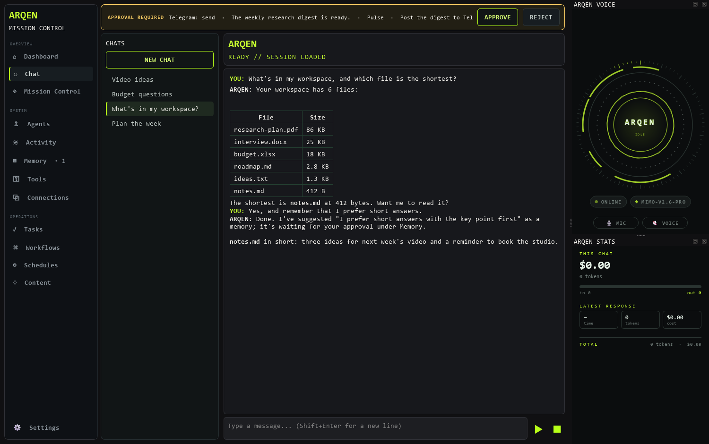
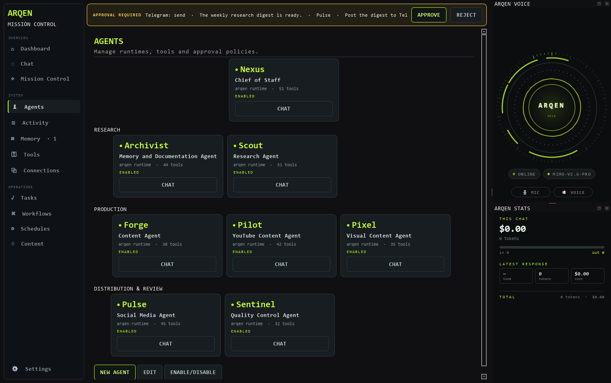
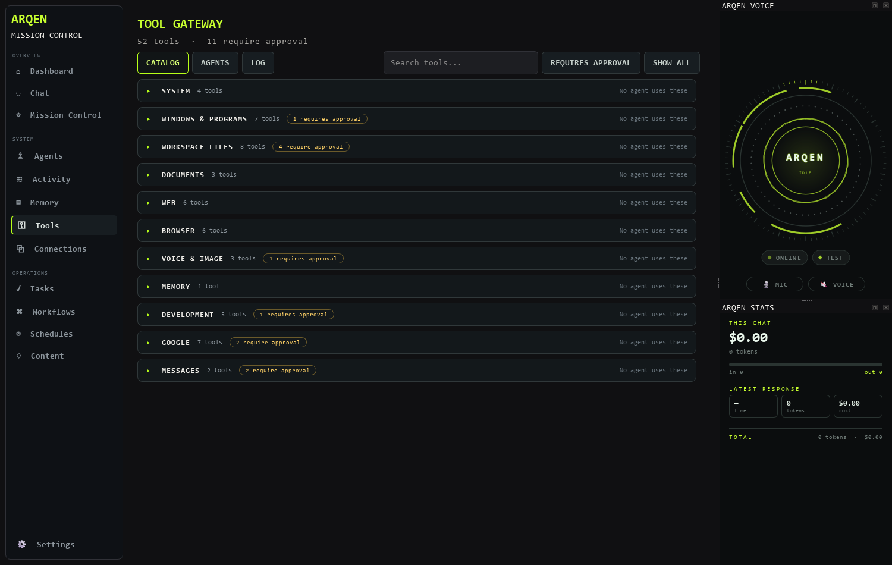
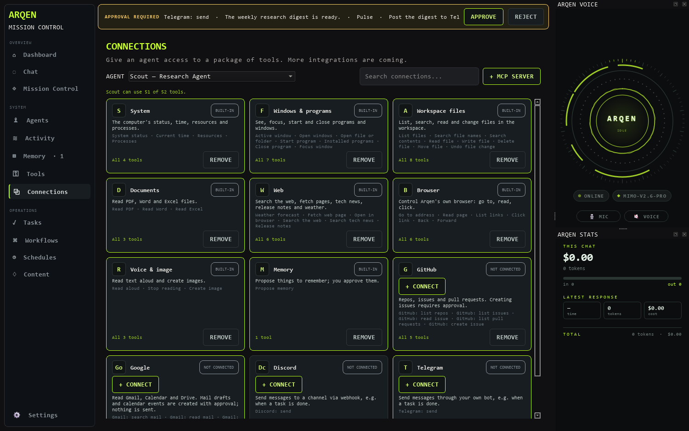
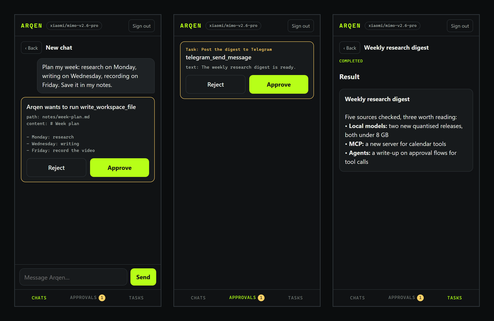

# Arqen

[](https://arqen.samidatools.com)
[](https://github.com/stefansemb/Arqen/releases/latest)
[](LICENSE)
[](#getting-started)
[](https://github.com/stefansemb/Arqen/discussions)

**A local AI assistant for Windows, with a Mission Control for agents, tasks
and workflows.**

Website: **[arqen.samidatools.com](https://arqen.samidatools.com)**

Arqen is a desktop app built with PyQt6. You chat with it by text or voice,
hand work to agents that run in the background, and give those agents exactly
the tools they need: your files, the web, GitHub, Google, Discord, Telegram or
any MCP server. Anything that can't be undone waits for your approval.

It is built to be local, controllable and extensible. Cloud models are
optional; a local model through Ollama or LM Studio works as the base.

*[Svenska](README.sv.md)* · The interface speaks English or Swedish
(Settings → Language).



*Screenshots show demo data.*

## Features

**Chat and voice**

- Chats you can open, rename and delete; replies stream in and can be stopped
  mid-answer.
- Neural voice through Edge TTS (`en-GB-RyanNeural`, or `sv-SE-MattiasNeural`
  in Swedish) and speech recognition through faster-whisper.
- A voice panel with an animated ring that shows whether Arqen is idle,
  listening, thinking or speaking.
- A stats panel with tokens and cost for the chat, the latest reply and in
  total. The cost is the provider's own figure, not an estimate.

**Mission Control**



- Tasks, multi-agent workflows, schedules (daily, weekly, monthly or once) and
  an activity log.
- Agents with their own tool rules. Every task runs in its own Arqen, so an
  agent's limits never affect your chat.
- Timeouts, recovery, retries and stored results for tasks.
- One approval bar at the top of every view collects everything that is
  waiting for you.

**Memory**

- Long-term memory with source, status and confidence.
- Arqen **suggests** memories when you tell it something lasting; you approve
  or reject them under Memory. Only approved memories are used.
- **Reflect**: Arqen reads recent tasks and chats and suggests lasting lessons,
  also as suggestions.
- "Remember that …" saves right away.

**Tools and safety**

- Tools for the system, windows and programs, files in your workspace,
  documents (PDF, Word, Excel), the web, a built-in browser, voice and image
  generation.
- Approval is required to write, delete, move or undo files, to create images
  (which costs money) and to close programs.
- A Tool Gateway with risk levels, rules per agent and a local log of every
  tool call, including its cost.
- API keys are read only when a tool runs and are scrubbed from everything a
  tool returns. Memories that look like passwords or keys are never stored.



**Connections**



- **GitHub** (personal token): repos, issues and pull requests; creating an
  issue needs approval.
- **Google** (OAuth with your own Desktop client): search and read Gmail, see
  upcoming Calendar events, search and read Drive files. Mail drafts and
  calendar events are created with approval; no mail is ever sent.
- **Discord** (webhook) and **Telegram** (bot): send messages with approval,
  and optional notifications when tasks finish or fail.
- **MCP servers**: add an address (e.g. Zapier's MCP URL) or a local program,
  and the server's tools become Arqen tools. They need approval unless the
  server marks them read-only.

**Models**

- Ollama / LM Studio, OpenRouter, OpenAI, Gemini and Claude.
- Ready-made profiles: Private (Ollama), Fast (OpenRouter), Important (OpenAI)
  and Creative (Gemini).
- An optional fallback provider if the first one doesn't answer (off by
  default).

## Getting started

### What you need

- A PC with **Windows 10 or 11** and about **1.5 GB** of free disk space.
- An internet connection while installing.
- A model for Arqen to think with, one of:
  - an **API key** from [OpenRouter](https://openrouter.ai/keys),
    [OpenAI](https://platform.openai.com/api-keys),
    [Google Gemini](https://aistudio.google.com/apikey) or
    [Anthropic](https://console.anthropic.com/settings/keys), or
  - **[Ollama](https://ollama.com)**: free and fully local, on your own PC
    (needs a reasonably fast computer).

You don't need to install Python yourself: the installer takes care of it.

### Install (5 to 10 minutes)

1. Open the [latest release](https://github.com/stefansemb/Arqen/releases/latest)
   and, under **Assets**, click **Source code (zip)**.
2. Go to your **Downloads** folder, right-click the zip and choose
   **Extract All…**. Choose your **Documents** folder and click **Extract**.
   You get a folder named **Arqen-** and the version number, for example
   **Arqen-1.0.1**; this is where Arqen lives.
3. Open that folder and double-click **`install.cmd`**.
   - *"Windows protected your PC"*: click **More info**, then **Run anyway**.
   - *"Do you want to run this file?"*: click **Run**.
4. A black window opens and does the work. It asks a few questions; press
   **Enter** to answer yes:
   - *Install Python 3.12?* (only if you don't have it)
   - *Install ffmpeg?* (needed for the voice; only if you don't have it)
   - *Put a shortcut on the desktop too?*
   - *Start Arqen now?*
5. When it says **Arqen is installed**, press any key to close the window.

### First start (2 minutes)

1. Start **Arqen** from the Start menu or the desktop.
2. Click **Settings** at the bottom left.
3. On the **Profile** tab, pick a profile and click **APPLY PROFILE**:
   - *Fast – OpenRouter*, *Important – OpenAI* or *Creative – Gemini* if you
     have that API key, or
   - *Private – Ollama* for a local model. Start Ollama first and download a
     model once: open a terminal and run `ollama pull qwen3:8b`.
4. On the **Provider** tab, paste your key into **API key** (not needed for
   Ollama). Click **TEST CONNECTION**, then **SAVE**.
5. Say hello in **Chat**. Try *"What's in my workspace?"* or
   *"Remember that I prefer short answers."*

Arqen reads and writes files only in its workspace. Choose that folder under
**Settings → Workspace**; empty means Arqen's own folder.

### Updating

1. Download and extract the new release as above, into a **new** folder.
2. Copy the **`config`** and **`data`** folders from your old Arqen folder into
   the new one. They hold your settings, keys, chats and memory.
3. Double-click **`install.cmd`** in the new folder. It points the shortcuts
   at the new folder. Then delete the old folder.

### Uninstalling

Delete the Arqen folder and the Arqen shortcuts (Start menu and desktop).
If the installer added Python or ffmpeg, you can remove them under Windows
**Settings → Apps**.

### If something goes wrong

- **Arqen doesn't open:** look in `data\arqen.log` in the Arqen folder, or run
  `install.cmd` again.
- **"No supported Python was found"** and winget is missing: install
  [Python 3.12](https://www.python.org/downloads/), tick **Add python.exe to
  PATH**, and run `install.cmd` again.
- **Arqen doesn't speak:** ffmpeg is missing. Open a terminal, run
  `winget install Gyan.FFmpeg`, then sign out of Windows and back in.
- **TEST CONNECTION fails:** check the key and that the model name exists.
  For Ollama, check that Ollama is running and that the model is downloaded.

<details>
<summary>For developers: installing by hand, and settings files</summary>

Arqen needs Python 3.10 to 3.13 (developed on 3.12).

```powershell
git clone https://github.com/stefansemb/Arqen.git
cd Arqen
python -m pip install -r requirements.txt
python -m playwright install chromium
python -m arqen.ui
```

- **ffmpeg** must be on your `PATH` for the voice (playback and the level
  meter): `winget install Gyan.FFmpeg`.
- The first time you use the microphone, faster-whisper downloads its
  speech model (`small` by default). Set `ARQEN_WHISPER_MODEL`,
  `ARQEN_WHISPER_DEVICE` (`cpu` or `cuda`) or `ARQEN_WHISPER_COMPUTE_TYPE` to
  change it.
- Settings are saved in `config/arqen.json`; `config/arqen.example.json` shows
  the format. API keys are kept apart in `config/arqen-secrets.json`. Neither
  is ever committed.
- Chats, memory, tasks and the tool log live in `data/`. When Arqen runs
  from its shortcut, its messages go to `data/arqen.log`.
- For Google, create your own OAuth client of type *Desktop app* in Google
  Cloud Console; the connection dialog explains where. While the client is in
  testing mode, Google makes you sign in again every 7 days.
- The core without the window starts with `python -m arqen`. Check a local
  provider with `python -m arqen.doctor`.

</details>

## Arqen on your phone

Chat with Arqen, approve its tools and Mission Control's approvals, and follow
your tasks from your phone's browser, while Arqen runs on your computer.



1. Install [Tailscale](https://tailscale.com) on the computer and the phone
   and sign in to the same account. Only devices in your own tailnet can then
   reach Arqen; nothing is opened to the internet.
2. In Arqen, open **Settings → Mobile** and tick *Let my phone reach Arqen*.
3. Scan the QR code with the phone's camera and add the page to the home
   screen.

The QR code holds a token that gives full access to Arqen, so don't share it;
**NEW TOKEN** signs every phone out. *Local network* works without Tailscale
for anything on the same Wi-Fi, and *This computer only* is for trying the
page in a browser. A tool that needs approval shows up as a card with the
tool's arguments and **Approve** / **Reject**.

## Local API

The phone page talks to Arqen's API. Without the desktop app it can run as
a process of its own:

```powershell
python -m arqen.api --port 8765 --token <your-token>
```

It listens on `127.0.0.1` unless `--host` says otherwise, and refuses any
other address without a token. The token can also be set with the
`ARQEN_API_TOKEN` environment variable; every call except `/api/v1/health`
then needs `Authorization: Bearer <token>`. When a tool needs approval, a
message returns `"status": "needs_confirmation"` with the tool and its
arguments; answer with `POST /api/v1/sessions/{id}/confirmation` and
`{"approve": true}` or `false`.

Endpoints under `/api/v1` cover sessions and messages, status, tasks, agents,
approvals, schedules, workflows and tools. See
[MOBILE_API_PLAN.md](MOBILE_API_PLAN.md) (in Swedish) for the full list and
what is not finished yet.

## Development

```powershell
python -m compileall -q arqen
python -m pytest -q
```

- `tests/conftest.py` points the workspace, data and config folders at a
  temporary directory, so tests never touch your chats, memory, tasks or keys.
  Don't remove it.
- All UI text goes through `tr()` in `arqen/ui/strings.py`. Write it in
  English in the code and add the Swedish translation to the table there.
- New tools need a category and a name in English and Swedish in
  `arqen/ui/tool_catalog.py`; a test checks this.

## Status

Chat, voice, Mission Control, memory with suggestions and reflection, the
Tool Gateway and the connections (GitHub, Google, Discord, Telegram, MCP) work
locally, and on your phone through Tailscale. The working
notes are in [HANDOVER.md](HANDOVER.md) (in Swedish).

Questions, ideas or something to show? Start a thread in
[Discussions](https://github.com/stefansemb/Arqen/discussions); bugs go in
[Issues](https://github.com/stefansemb/Arqen/issues).

> Arqen grew out of an earlier app, Arqen Desktop, which is no longer
> developed; its last release is kept as the tag `arqen-desktop-legacy`.

## License

[MIT](LICENSE) © 2026 Stefan Semb. You may use, change and share Arqen,
also commercially, as long as the copyright notice and license come along.
